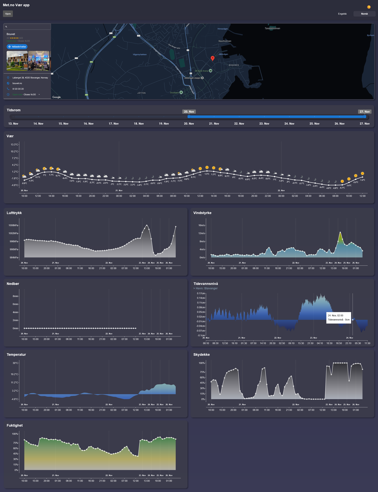

# MetWeatherApp

MetWeatherApp is a weather application that provides real-time weather information using the MET Norway Weather API. The frontend is built with TypeScript and React using Vite, and the backend is developed with C# and ASP.NET.

## Table of Contents

- [Introduction](#introduction)
- [Features](#features)
- [Demo](#demo)
- [Screenshots](#screenshots)
- [Prerequisites](#prerequisites)
- [Installation](#installation)
  - [Frontend Setup](#frontend-setup)
  - [Backend Setup](#backend-setup)
- [Usage](#usage)
- [Technologies Used](#technologies-used)
- [API Reference](#api-reference)
- [License](#license)

## Introduction

MetWeatherApp delivers current weather data for any specified location. By leveraging the MET Norway Weather API, it provides users with accurate weather forecasts and conditions in a user-friendly web interface.

## Features

- **Current Weather Data**: View real-time temperature, humidity, wind speed, and weather conditions.
- **Location Search**: Search for weather information by city or coordinates.
- **Interactive UI**: Responsive design built with React for a seamless user experience.
- **Backend API**: A robust backend built with ASP.NET to handle API requests and data processing.

## Demo

A live demo of the application is available at:

🔗 **[MetWeatherApp Demo](https://haavard-hoijord.github.io/MetWeatherApp/)**

You can visit the link to experience the application without setting it up locally.

## Screenshots



## Prerequisites

Before you begin, ensure you have met the following requirements:

- **Node.js** installed on your machine (for the frontend).
- **.NET 6 SDK** or later installed (for the backend).
- **Git** for cloning the repository.
- An active internet connection to fetch data from the MET Norway API.

## Installation

### Frontend Setup

1. **Navigate to the Frontend Directory**

   ```bash
   cd MetWeatherApp/frontend
   ```

2. **Install Dependencies**

   ```bash
   npm install
   ```

3. **Configure Environment Variables**

   - Create a `.env` file in the `frontend` directory.
   - Add any necessary environment variables (if applicable).
   - `VITE_GOOGLE_MAPS_API_KEY` & `VITE_API_URL`

### Backend Setup

1. **Navigate to the Backend Directory**

   ```bash
   cd MetWeatherApp/backend
   ```

2. **Restore Dependencies**

   ```bash
   dotnet restore
   ```

## Usage

### Running the Application

#### Start the Backend Server

1. **Navigate to the Backend Directory**

   ```bash
   cd MetWeatherApp/backend
   ```

2. **Run the Backend**

   ```bash
   dotnet run
   ```

   The backend server should now be running on `https://localhost:44357/`.

#### Start the Frontend Application

1. **Navigate to the Frontend Directory**

   ```bash
   cd MetWeatherApp/frontend
   ```

2. **Run the Frontend**

   ```bash
   npm run dev
   ```

   The frontend application should now be running on `http://localhost:5173/MetWeatherApp/`.

### Accessing the Application

- Open your web browser and navigate to `http://localhost:5173/MetWeatherApp/` to use MetWeatherApp.

## Technologies Used

- **Frontend**:
  - TypeScript
  - React
  - Vite
  - Axios
  - Styled Components
  - Google Maps
  - i18next

- **Backend**:
  - C#
  - ASP.NET Web API
  - RESTful API principles

- **APIs**:
  - [MET Norway Weather API](https://api.met.no/)

## API Reference

The application uses the [MET Norway Weather API](https://api.met.no/) to fetch weather data.

- **Endpoint**

  ```http
  GET https://api.met.no/weatherapi/locationforecast/2.0/complete
  ```

- **Parameters**

  - `lat` - Latitude of the location (URL parameter)
  - `lon` - Longitude of the location (URL parameter)
  - `altitude` - Altitude of the location in meters (URL parameter)

- **Headers**

  - `User-Agent` - Required by MET Norway API policy (include app name and contact information)

- **Example Request**

  ```javascript
  // Using Axios in the frontend
  axios.get('https://api.met.no/weatherapi/locationforecast/2.0/complete', {
    headers: {
      'User-Agent': 'MetWeatherApp/1.0 (contact@example.com)'
    },
    params: {
      lat: 60.10,
      lon: 9.58,
      altitude: 70
    }
  });

## License

This project is licensed under the MIT License. See the [LICENSE](LICENSE) file for details.
